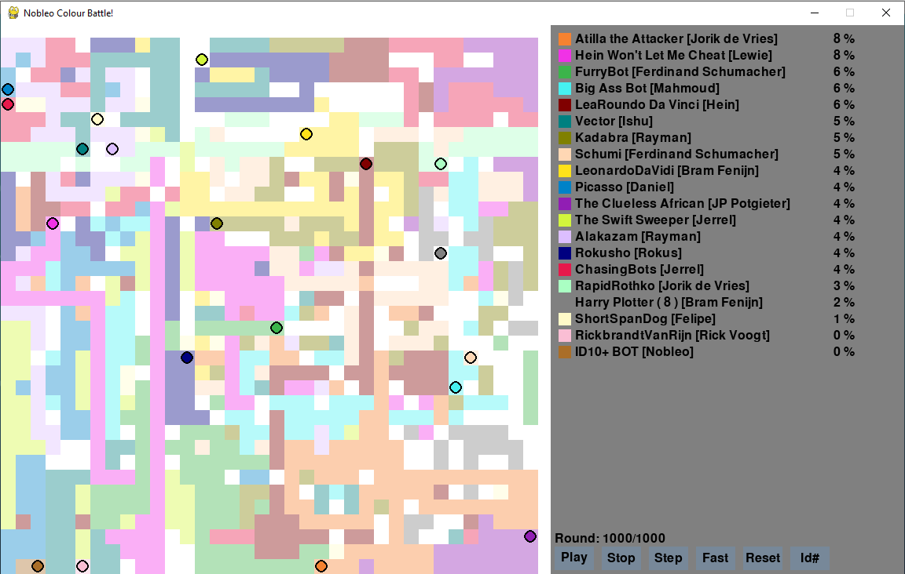
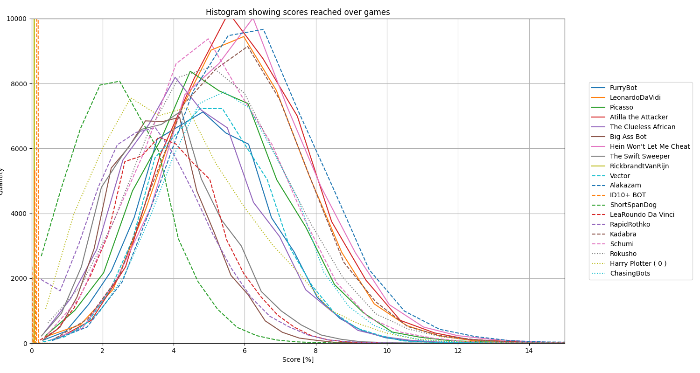

# Coding Challenge: Colour Battle!



## Current Standings
_Last updated: 8 April 2023 20:00_

**Score:**
```
Rank Name                          Contributor         Avg [us]       Score  
1    Kadabra                       Rayman              844.221        7.334   %
2    Hein Won't Let Me Cheat       Lewie               725.044        7.223   %
3    Atilla the Attacker           Jorik de Vries      740.915        7.061   %
4    Abra                          Rayman              693.788        6.485   %
5    Picasso                       Daniel              426.169        6.467   %
6    Schumi                        Ferdinand Schumacher481.532        6.147   %
7    The Clueless African          JP Potgieter        36.869         5.398   %
8    FurryBot                      Ferdinand Schumacher127.973        5.276   %
9    LeonardoDaVidi                Bram Fenijn         71926.411      5.094   %
10   Short Sighted Steve           Nobleo              63.355         4.95    %
11   LeaRoundo Da Vinci            Hein                436.153        4.091   %
12   Aslan                         Hakan               13.384         3.708   %
13   ShortSpanDog                  Felipe              13.364         3.703   %
14   Rambo The Rando               Nobleo              13.586         3.691   %
15   Vector                        Ishu                13.529         3.664   %
16   Big Ass Bot                   Mahmoud             54.934         3.519   %
17   RapidRothko                   Jorik de Vries      8.123          3.412   %
18   ID10+ BOT                     Nobleo              19172.212      0.136   %
19   RickbrandtVanRijn             Rick Voogt          1.996          0.073   %
```
**Efficiency:**
```
Rank Name                          Contributor         Avg [us]       Score [%]   Efficiency [%/us]
1    RapidRothko                   Jorik de Vries      8.123          3.412       0.42        
2    ShortSpanDog                  Felipe              13.364         3.703       0.277       
3    Aslan                         Hakan               13.384         3.708       0.277       
4    Rambo The Rando               Nobleo              13.586         3.691       0.272       
5    Vector                        Ishu                13.529         3.664       0.271       
6    The Clueless African          JP Potgieter        36.869         5.398       0.146       
7    Short Sighted Steve           Nobleo              63.355         4.95        0.078       
8    Big Ass Bot                   Mahmoud             54.934         3.519       0.064       
9    FurryBot                      Ferdinand Schumacher127.973        5.276       0.041       
10   RickbrandtVanRijn             Rick Voogt          1.996          0.073       0.037       
11   Picasso                       Daniel              426.169        6.467       0.015       
12   Schumi                        Ferdinand Schumacher481.532        6.147       0.013       
13   Hein Won't Let Me Cheat       Lewie               725.044        7.223       0.01        
14   Atilla the Attacker           Jorik de Vries      740.915        7.061       0.01        
15   LeaRoundo Da Vinci            Hein                436.153        4.091       0.009       
16   Abra                          Rayman              693.788        6.485       0.009       
17   Kadabra                       Rayman              844.221        7.334       0.009       
18   LeonardoDaVidi                Bram Fenijn         71926.411      5.094       0.0         
19   ID10+ BOT                     Nobleo              19172.212      0.136       0.0 
```
_Note: These results are not a from a full tournament in the correct configuration. Final results might differ._

## Description

The goal is the fill as much as possible of the canvas with your bot's colour. The bot with the most tiles win! *Be weary of other bots who might want to paint over your hard work!* There will also be a secondary prize for the bot that claimed the most tiles using the least amount of _processing time_!

[View the already submitted bots battle online here!](https://nobleans-playground.github.io/coding-challenge-colour-battle/)

You will write your bot's logic in a Python class. In each iteration of the game a specific function in your bot will be called (with relevant information as arguments), and your bot will need to decide in which direction to turn.

Here you can see two example bots. Do you have what it takes to out-paint _Rambo the Rando?!_
- [Rambo the Rando](https://github.com/nobleans-playground/coding-challenge-bot-template/blob/main/rambo_the_rando.py)
- [Short Sighted Steve](https://github.com/nobleans-playground/coding-challenge-colour-battle/blob/master/robots/short_sighted_steve.py)

## Some Concepts

### The Grid

This is the square canvas on which your bot will paint. It's a 2D grid of integers, where the integer contains the `id` of the bot who's colour is painted there, or `0` if it's unpainted. The size of the grid will be scaled with the amount of bots in on the grid, with the following equation:

``` Python
cells_per_bot = 8 * 8    # The amount of space every bot will have on average
grid_side_length = math.ceil(math.sqrt(cells_per_bot * number_of_bots))
grid = np.zeros(grid_side_length, grid_side_length, dtype=np.int16)
```

### Your Bot

Your bot will move around on the grid (or canvas). Each round you can choose if it will go `UP`, `DOWN`, `LEFT`, `RIGHT` or `STAY` where it is currently. After every move it will attempt to paint the tile beneath it, but if it's successfull depends on its randomly assigned `id` (starting at `1`). The following equation is used:

``` Python
def determine_new_tile_colour(self, floor_colour, bot_colour):
        if floor_colour == 0: return bot_colour # Bot always paints a white floor tile
        return [floor_colour, 0, bot_colour][(bot_colour - floor_colour) % 3]
```

The goal of this equation is to allow smarter bots to perform better by possibly seeking the tiles that are easier to paint. 

**Note:** If two robots occupy the same tile then the tile will be painted white, regardless of bot `id`.

As mentioned your bot will be a Python class where you will write the logic the bot will use to decide what to do next. How the bot determines what to do next is up to you. You could train an AI, do weighted path-planning, or simply hunt the highest scoring opponent. As long as it won't fry my laptop trying to run it, it's fine.

Each round your bot will execute the following function that will receive these arguments:

``` Python

# This function is called every round. It contains
#   self
#       id                  Your randomly assigned ID
#       position            Your current position on the grid
#   grid                    A np.array((N, N), dtype=np.int16) containing
#                           the current colours of all the grid tiles. As
#                           mentioned the colours are basically the id
#                           of the bot who painted it. 0 means unpainted, white.
#   enemies[]               A list of all the bots on the grid, including you
#       id                  Id of this enemy (or you)
#       position            Position of this enemy (or you) on the grid
#   game_info               General info about this game
#       current_round       The current round starting at 1
#       number_of_rounds    The current round starting at 1
#       grid_size           Width (or height) of the grid.
def determine_next_move(self, grid, enemies, game_info):
    # Your logic here
    return Move.UP  # This bot will always go up. An invalid move will be treated as Move.STAY.
```
**Note:** Any moves to outside the grid limits will simply be ignored.

## Final Scoring
The final standings will be determined in an epic tournament consisting of 1000 games consisting of a 1000 rounds each where all bots will be placed in a single arena. After each game the total the amount of painted tiles for each bot will be counted, and at the end all the tournament all the game's scores will be added together.

**Note:** The amount of games or rounds might be adjusted depending on the amount of bots submitted, or if it's found that 1000 is not long enough for an accurate representation. If the amount of bots is too large then a Round-Robin-ish implementation might be implemented.

## Submitting

Your bot will live as a git submodule inside the main challenge repository. This means you will need to create your own GitHub account and create a new repository based on a template. You can follow the following steps to create your own bot.  

**Note:** You are allowed to submit a maximum of two bots.

**Steps to submit a bot:**
1. Create a GitHub account if you don't have one already. Using a personal account is fine.
2. Ask me (Hein) to add you to the [Nobleans Playground](https://github.com/nobleans-playground) Organisation. **Note:** This is optional. You will only need this if you want to use a repository template for Step 3.
3. Create a personal repository where your bot will live. It needs to look like this [template](https://github.com/nobleans-playground/coding-challenge-bot-template). If you joined the Playground Organisation you can select the `template-bot` as template for your new repository.
4.  Give your bot a custom name, add your name as contributor, and some custom logic (can be done later as well).
5. Notify a organizer (Hein Wessels) to add your bot to the challenge as a submodule in the main repository. **Note:** Your bot doesn't have to be complete to be added. It simply needs to run and return a valid move. You can update/change/refactor your bot at any point during the challenge.
6. After your bot has been added you observe it fighting for colour squares [online](https://nobleans-playground.github.io/coding-challenge-colour-battle/)!

**Running the challenge on your own machine**
1. Clone _this_ repository using `git clone --recursive [URL]`. The `--recursive` is to pull in all submodule bots.
2. If your bot's submodule has been added as a submodule then you can develop your bot in your folder. Remember to `add/commit/push` your changes once you're done so that the online simulation can be updated with your newest bot. (Will still need a manual refresh by an organiser)
3. **If your bot has not been **added to the main repository you can temporarily add it to `robots/`, similar to `ShortSightedSteve`. Remember to add ot tp `bot_list.py` as well.
4. Choose a workspace to code in. I would recommend Visual Studio Code (VSCode), which works well for Windows or Ubuntu.
4. Run `main.py` to watch the current bots battle for the canvas with a nice GUI (if using VSCode press `F5` to run it in `debug` mode). Or run `tournament.py` to run it without a GUI and simply print out the end rankings.

**Updating your local repository with the newest changes**
Over the course of the challenge your local repository might be out-of-date with all the other bots. To update the environent you can run the following two commands from the root folder.
```bash
# Pull the latest game-code
git pull
# Pull the latest code from all the bots
git submodule update --remote
```
## Running the bot on your machine
You can develop and test your bot on your local machine, and should be doable on either Windows or Linux. All you need is the following Python packages on your machine, `pygame` and `numpy`.

You can run the game in two modes by running one of the following two files:
- `main.py`: Regular game with GUI.
- `tournament.py`: Run a test tournament without a GUI. After it's done it will print out the rankings. Use `--games 100` or `--rounds 100` to alter the length of the tournament. Defaults to one game of 1000 rounds. Add `--graph` to output a nice graph showing the performance of all bots like [this](https://github.com/nobleans-playground/coding-challenge-colour-battle#Some-Statistics).
- `time_trails.py`: Measures how long your bot takes to decide it's next move. For a quick description on how to optimize your bot for time have a look at the [Profiling Section](https://github.com/nobleans-playground/coding-challenge-colour-battle#Profiling-Your-Bot).

## Rules
1. Targetting a specific other bot is not allowed, although you may target the tactics of a general class of bot. You may target a specific bot ID, beause it's impossible to know which bot it belongs to. This mostly means you may not reverse engineer someone's bot and then create a bot that effectively neutralizes it because you know it's next move. 
2. Bots may work together but may not communicate with each other and will not know each others IDs (will be randomized anyway). The wins will be awarded individually rather than as a team.
3. You may not attempt to alter other bot's internal state, or any other internal game variables, f.i. `id`, `position`, the `grid`, etc.
4. Python libraries that will simplify this challenge may **not**. An exception can be made for lightweight-ish neural networks if you trained the bot yourself.
5. Your bot may not intentionally crash. During the tournament any crashes of your bot will be treated as `Move.STAY` command.
6. Please limit the processing time of your bot. Currently there's a hard limit of `20ms` _average_ time-per-move as measured on my laptop using `time_trails.py`. Please talk to me (Hein) if you think this is too short. You can also use a profiler to try and make your code faster.
7. Your bot must be your own creation. This rule is so that you may not blatantly copy someone's bot, change only a few lines, and then submit it as your own. *Some* code duplication is of course inevitable and thus allowed, because the logic might be similar between bots.
8. No multithreading is allowed.


## Profiling Your Bot

Note: The following steps don't work anymore since multi-threading was introduced in `tournament.py`.

One aspect of the challenge is to try and optimize your bot's processing time to become the most efficient. One way to do it in Python using `cPython` by following these steps:
```bash
# Run the tournament through a profiler
# It might be worth it to remove most other 
# processing-intensive bots from the tournament,
# which could give clearer results on your bot
python3 -m cProfile -o output.pstats tournament.py

# The generated file can displayed in multiple ways. One way is turn 
# this into an image, like this:
python3 -m gprof2dot -f pstats output.pstats | dot -Tpng -o output.png
```
This will create an image containing a flowchart with blocks representing functions. The redder the block, the more time is taken to process that function. You can use this as direction on where to optimize your code. For example, it showed that in a bot I created the `np.clip` function was taking the majority of time, which I would never have suspected. I then changed my code to not require the clip function, which significantly sped up mu code.

**Important:** Premature optimization is the [root of all evil](https://m.xkcd.com/1691/). First ensure your bot is functioning properly before attempting optimiziation.

## Some Statistics
Below is a histogram created on March 18 showing the distrubution of scores achieved by different bots (ignoring `id10plus` and `RickbrandtVanRijn`).

